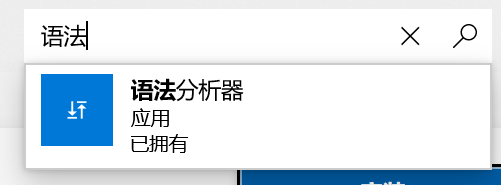
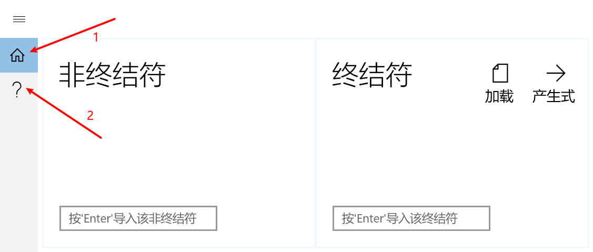

**VERY VERY VERY grateful for the new policy released by Microsoft the recent years, causing my app's backend kernel in C++ and C++/Cli all banned when publishing a new version on *App Store*. I have to rewrite the whole kernel in C# instead of just plugging a simple .dll.**

# 语法分析器 GrammarAnalyzer

## 目录

[1  简介](#1  简介)

​	[1.1  开发背景](#1.1  开发背景)

​	[1.2  用途](#1.2  用途)

[2  获取与安装](#2  获取与安装)

​	[2.1  Windows应用商店](#2.1  Windows应用商店)

​	[2.2  安装包](#2.2  安装包)

[3  使用手册](#3  使用手册)

​	[3.1  主页](#3.1  主页)

​		[3.1.1  产生式](#3.1.1  产生式)

​		[3.1.2  状态机](#3.1.2  状态机)

​		[3.1.3  语法分析](#3.1.3  语法分析)

​	[3.2  帮助页](#3.2  帮助页)

## 1  简介

在国内高校，例如某📮，学习编译原理课程中的语法分析内容时，强烈要求掌握有（ku）趣（zao）生（wu）动（wei）的上下文无关文法的基本概念，以及构造 LL(1)、 SLR(1)以及 LR(1)分析表和分析程序的方法（LALR暂未在此应用中实现）。该应用能帮助使用者自动构造确定文法的 LL(1)、 SLR(1)以及 LR(1)分析程序，极大地节省了手动构造所带来的时间开销（省去无脑手写的功夫），并且也能帮助使用者判断其手动构造的分析表是否正确（指快速完成各类手写作业）。

### 1.1  开发背景

学习编译原理课程时，一个小作业，但使用控制台交互、文件输入等方式，欠缺可视化，交互不便捷（不利于自动化帮我写作业），为此在UWP平台弄一个图形界面的应用。最开始用C++语言编写了控制台程序版本，迁移至UWP平台要求原生语言C#，多亏微软（巨硬）费力搞了个C++/Cli，专门用来做C++外壳套皮，从而实现前端C#通过中间层调用C++动态库，2015年的最初版本得益于此特性，还算比较便捷得实现了C#做UI，而计算依靠C++，然后成功上架应用商店，但是在16年UWP更新协议之后，不准上架的UWP应用继续使用C++后端编写的动态库，这下成功寄了👋，因此花了点功夫按照C#的语法要求完全重构了整个后端，并重新发布应用。

**目前是2022年3月，搁置长久时间之后，补全文档、完善UI交互逻辑，提供多语言版本，希望能够提升用户体验**👍

### 1.2  用途

唯一的目的，自动化写文法分析的作业，然后自己抄自己。

向无脑的体力作业说，“不”✋

## 2  获取与安装

### 2.1  Windows应用商店

该UWP应用上架已至Windows应用商店 👉 检索“语法分析器”即可

### 2.2  安装包

## 3  使用手册

### 3.1  主页

#### 3.1.1  产生式

#### 3.1.2  状态机

#### 3.1.3  语法分析

### 3.2  帮助页

